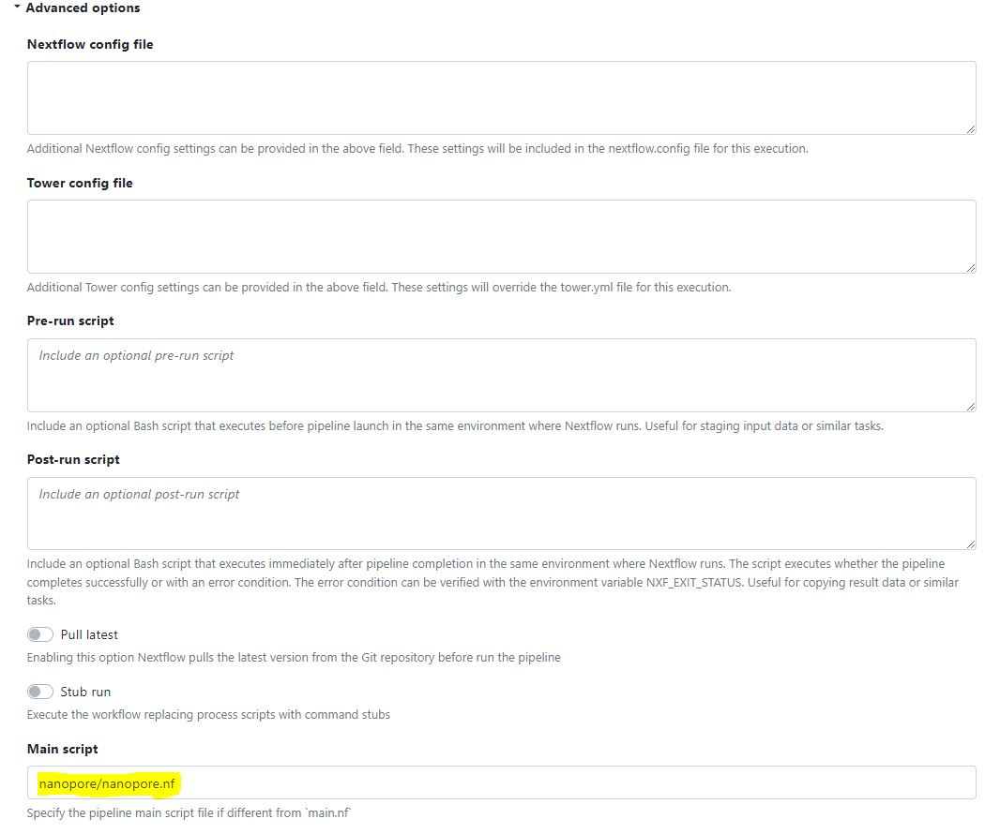

# covid-sequence-analysis-workflow

This branch shows the interoperability of the pipeline to execute on any Cloud Provider or HPC cluster.
We will describe the use of GCP as the cloud platform in this instance.
If you need to run the pipelines on your own on premise HPC cluster or on AWS, the appropriate [compute environment](https://help.tower.nf/22.4/compute-envs/google-cloud-lifesciences/) needs to be setup on Nextflow tower.
You will also need to change the paths for params.INDEX, params.STOREDIR, params.OUTDIR, params.SARS2_FA, params.SARS2_FA_FAI and params.SECRETS.

## Prerequisites

1. Have access to a [Google Cloud account](https://cloud.google.com/free)
2. Have a [Nextflow tower](https://cloud.tower.nf/pricing/) account
3. Have a list of samples in a .tsv file e.g:
	https://github.com/enasequence/covid-sequence-analysis-workflow/blob/demo/TSVs/illumina.tsv

### Preparation

1. Follow the setup instructions as described on Nextflow tower to setup a [compute environment](https://help.tower.nf/22.4/compute-envs/google-cloud-lifesciences/) on Google
2. Follow the setup instructions as described on Nextflow tower to [integrate](https://help.tower.nf/22.4/git/overview/#github) the codebase
3. Create a project on GCP and a [Bucket](https://console.cloud.google.com/storage/browser) with the following files and folders:
	a. Files - illumina5.tsv, nanopore5.tsv, data/projects_accounts.csv, [data/NC_045512.2.fa.fai](https://github.com/enasequence/covid-sequence-analysis-workflow/blob/5b6b53b3a228ec55cb1b34bbc3aec5ec31759edd/illumina/illumina.nf#L12), [data/NC_045512.2.fa](https://www.ncbi.nlm.nih.gov/nuccore/1798174254)
	b. You have to use [samtools](https://www.htslib.org/doc/samtools-faidx.html) to create the .fai file from the .fa reference sequence file
	c. Folder - data to store data/NC_045512.2.fa, data/NC_045512.2.fa.fai and data/projects_accounts.csv
	d. project_accounts.csv is a file that contains the following headers and appropriate values:
	https://github.com/enasequence/covid-sequence-analysis-workflow/blob/demo/TSVs/project_accounts.csv

### Running pipelines via Nextflow tower

1. Setup a [new](https://tower.nf/user/sands/launchpad/new) pipeline on Nextflow tower, make sure to fill in values for the fields that have *(Required)*
2. Make sure your **Compute environment** is configured to GCP as described in the Preparation section
3. Add the URL of this reposotory in the field for **Pipeline to launch**
4. **Work directory** is a Bucket that you need to create on GCP as described in the Preparation section
5. Depending on which pipeline you want to run, add the following in the **Advanced options**:
	Nanopore - [nanopore/nanopore.nf](https://github.com/enasequence/covid-sequence-analysis-workflow/blob/demo/nanopore/nanopore.nf)
	Illumina - [illumina/illumina.nf](https://github.com/enasequence/covid-sequence-analysis-workflow/blob/demo/illumina/illumina.nf)
	
6. If you make changes to this fork make sure to enable the button to pull latest changes in the **Advanced options**
	
7. Click on **Add** at the bottom right corner
8. Once your pipeline is ready, make sure your sample file is uploaded on GCP and is at the location the script reads it from:
	a. For running Nanopore the samples are read from [here](https://github.com/enasequence/covid-sequence-analysis-workflow/blob/5b6b53b3a228ec55cb1b34bbc3aec5ec31759edd/nanopore/nanopore.nf#L4)
	b. For running Illumina the samples are read from [here](https://github.com/enasequence/covid-sequence-analysis-workflow/blob/5b6b53b3a228ec55cb1b34bbc3aec5ec31759edd/illumina/illumina.nf#L4)
	Make sure to change these values to point to your files and GCP account
9. After successful analysis, samples will be submitted with a test flag to the test server account matching the study: https://github.com/enasequence/covid-sequence-analysis-workflow/blob/5b6b53b3a228ec55cb1b34bbc3aec5ec31759edd/illumina/illumina.nf#L16. Since the test flag is set to true, the samples will be deleted at the end of the day.
10. Analysis results can also be seen in the results: https://github.com/enasequence/covid-sequence-analysis-workflow/blob/5b6b53b3a228ec55cb1b34bbc3aec5ec31759edd/illumina/illumina.nf#L6 folder on GCP